安装IbPy2

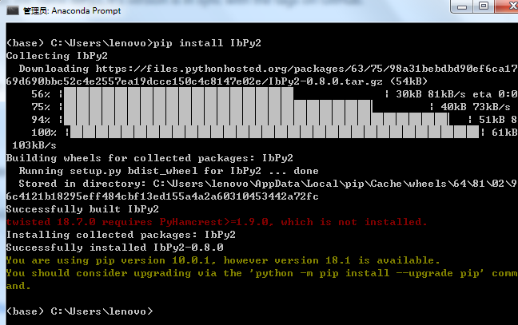

使用demo账号登录

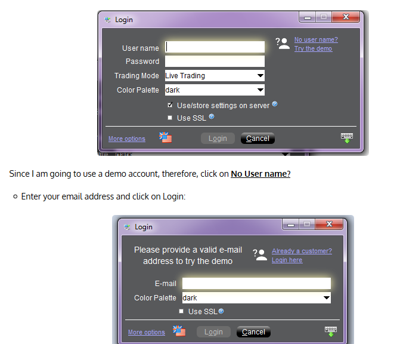

-   Check the **Enable ActiveX and Socket Clients**

-   Set **Socket port** to unused port.（默认7496可以不变）

-   Set the **Master API client ID** to 100（默认留空，可以不改）

-   Create a **Trusted IP Address** and set to 127.0.0.1

-   Uncheck **Read-Only API**

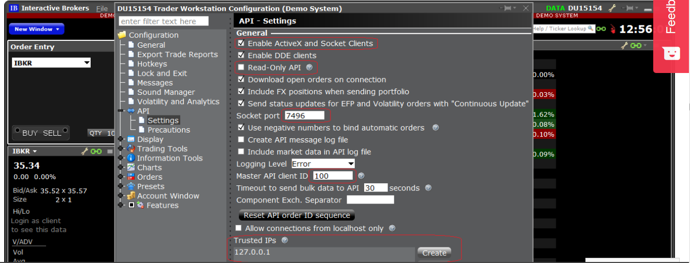

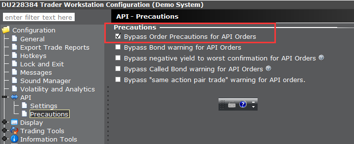

勾选Bypass order Precautions for API Orders

这样就不会还要手动去点击蓝色Transmit按键使得指令生效

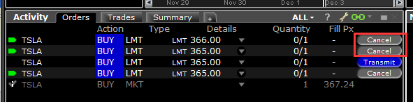

demo账户下进行美股测试可以很好模拟，demo账号下港股也能模拟买卖（之前偶尔发生demo账号下港股无法模拟买卖）

以下是真实账户下的输出

\<openOrder orderId=1543990138, contract=\<ib.ext.Contract.Contract object at
0x000000000927CA90\>, order=\<ib.ext.Order.Order object at 0x000000000927CA58\>,
orderState=\<ib.ext.OrderState.OrderState object at 0x000000000927CB00\>\>

\<orderStatus orderId=1543990138, status=Submitted, filled=0, remaining=2000,
avgFillPrice=0.0, permId=2028508709, parentId=0, lastFillPrice=0.0, clientId=0,
whyHeld=None\>

\<orderStatus orderId=1543990138, status=Cancelled, filled=0, remaining=2000,
avgFillPrice=0.0, permId=2028508709, parentId=0, lastFillPrice=0.0, clientId=0,
whyHeld=None\>

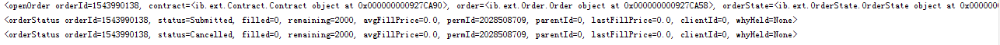

相关买卖指令会出现在API 标签页中

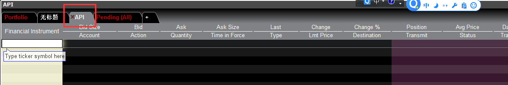

*\#python 2.7*

**from** ib.opt **import** Connection, message

**from** ib.ext.Contract **import** Contract

**from** ib.ext.Order **import** Order

**import** time

*\#https://pythonprogramming.net/ibpy-tutorial-using-interactive-brokers-api-python/*

*\#IBPy Tutorial for using Interactive Brokers API with Python*

*\#watcher(msg) copy from github ...\\IbPy\\demo\\fancy_marketdata*

*\# print all messages from TWS*

**def** watcher(msg):

**print** msg

**def** makeStkContract(contractTuple):

newContract = Contract()

newContract.m_symbol = contractTuple[0]

newContract.m_secType = contractTuple[1]

newContract.m_exchange = contractTuple[2]

newContract.m_currency = contractTuple[3]

newContract.m_expiry = contractTuple[4]

newContract.m_strike = contractTuple[5]

newContract.m_right = contractTuple[6]

**print 'Contract Values:%s,%s,%s,%s,%s,%s,%s:'** % contractTuple

**return** newContract

**def** make_contract(symbol, sec_type, exch, prim_exch, curr):

Contract.m_symbol = symbol

Contract.m_secType = sec_type

Contract.m_exchange = exch

Contract.m_primaryExch = prim_exch

Contract.m_currency = curr

**return** Contract

**def** make_order(action,quantity, price = None):

**if** price **is not** None:

order = Order()

order.m_orderType = **'LMT'**

order.m_totalQuantity = quantity

order.m_action = action

order.m_lmtPrice = price

**else**:

order = Order()

order.m_orderType = **'MKT'**

order.m_totalQuantity = quantity

order.m_action = action

**return** order

*\#cid = 303*

*\#Use the time as random cid*

cid=int(time.time())

*\#because of there is no define for clientID in TWS,delete it here.*

*\#Check the port is same to TWS*

conn = Connection.create(port=7497)

*\#conn = Connection.create()*

*\#conn = Connection.create(port=7496)*

*\#registerAll(watcher) copy from github ...\\IbPy\\demo\\fancy_marketdata*

conn.registerAll(watcher)

conn.connect()

oid = cid

*\#USA Stock Exchange*

*\#cont = make_contract('TSLA', 'STK', 'SMART', 'SMART', 'USD')*

*\#offer = make_order('BUY', 1,366.5)*

*\#HK Stock Exchange*

cont = make_contract(**'177'**, **'STK'**, **'SEHK'**, **'SEHK'**, **'HKD'**)

offer = make_order(**'BUY'**, 2000, 10.40)

conn.placeOrder(oid, cont, offer)

cid += 1

oid = cid

*\#cont = make_contract('TSLA', 'STK', 'SMART', 'SMART', 'USD')*

*\#offer = make_order('BUY', 1)*

cont = make_contract(**'177'**, **'STK'**, **'SEHK'**, **'SEHK'**, **'HKD'**)

offer = make_order(**'BUY'**, 2000)

conn.placeOrder(oid, cont, offer)

conn.disconnect()

以下是非常重要的参考资料

https://www.quantinsti.com/blog/ibpy-tutorial-implement-python-interactive-brokers-api

I hope you had a great time attending our webinar on **Trading with Interactive
Brokers using Python**, I thought it would be a very good idea to give you a
brief insight on **Interactive Brokers API** and using **IBPy** to
implement Python in IB’s TWS. As we proceed, you will need an Interactive
Brokers demo account and IBPy. Towards the end of this article, you will be
running a simple order routing program using **Interactive Brokers API**.

For those of you who are already aware of Interactive Brokers (IB) and its
interface, you can very well understand why I prefer IB over other available
online brokerages. However, for those who have not used IB, this would be the
first question that comes to mind:

**Why Interactive Brokers?**

**Interactive Brokers is my first choice because of 5 simple reasons:**

1.  International Investing in more than 100 markets

2.  **Commission rates that are highly competitive**

3.  Low margin rates

4.  **Very friendly user interface**

5.  Vast selection of order types

Among the five points mentioned above, the most important and impressive one for
any beginner is point no. 2 and point no. 4, isn’t it?. The **Interactive
Brokers API** can be used in a professional context even for those who are
completely alien to it. Interactive Broker API’s connectivity with Java, C++ and
Python is very impressive as well.

Enough said it is time to move to the next step. I can understand that most of
you must already be eager to test their hand at the Interactive Brokers API
panel. After all, nobody could say no to something very friendly that is
lucrative as well. You can easily set up your account on Interactive Brokers by
going to their website. There is an option wherein you can opt for a free trial
package.

Algorithmic traders prefer Interactive Brokers due to its *relatively
straightforward API.* In this article, I will be telling you how to automate
trades by implementing Python in the Interactive Brokers API using a bridge
called **IBPy**.

As Interactive Brokers offers a platform to an incredibly wide spectrum of
traders, therefore, its GUI consists of a myriad of features. This standalone
application is called Trader Workstation or *TWS* on Interactive Brokers. Apart
from the Trader Workstation, Interactive Brokers also has an **IB
Gateway.** This particular application allows IB servers to access it using a
Command Line Interface. Algo traders usually prefer using this over GUI.

### What is IBPy?

*BPy is a third-party implementation of the API used for accessing the
Interactive Brokers on-line trading system. IBPy implements functionality that
the Python programmer can use to connect to IB, request stock ticker data,
submit orders for stocks and futures, and more.*

The purpose of IBPy is to conceive the native API, that is written in Java, in
such a way that it can be called from Python. Two of the most significant
libraries in IBPy are ib.ext and ib.opt. ib.opt derives from the functionality
of ib.ext. Through IBPy, the API executes orders and fetches real-time market
data feeds. The architecture essentially utilizes a client-server model.

### Implementation of IB in Python

First of all, you must have an Interactive Brokers account and a Python
workspace to install IBPy, and thereafter, you can use it for your coding
purposes.

#### Installing IBPy

As I had mentioned earlier, *IBPy* is a **Python emulator** written for the
**Java-based** *Interactive Brokers API*. IBPy helps in turning the development
of **algo trading systems** in Python into a less cumbersome process. For this
reason, I will be using it as a base for all kinds of interaction with the
Interactive Brokers TWS. Here **I am presuming that you have Python 2.7
installed on your system, else you may download it from
here: ***https://www.continuum.io/downloads*

#### Installing On Ubuntu

##### Acquisition

IBPy can be acquired from GitHub repository.

The following code will be needed on an Ubuntu system:

sudo apt-get install git-core

##### Creation of subdirectory

mkdir \~/ibapi

##### Download IBPy

cd \~/ibapi

git clone https://github.com/blampe/IbPy

cd \~/ibapi/IbPypython setup.py.in install

Great! You have installed Python on your Ubuntu system.

##### Installing IBPy on Windows

Go to the github repository and download the file from: *https://goo.gl/e6Idr6*

Unzip the downloaded file. Move this folder to the directory where you have
installed Python so that it can recognize this package:

**\\\\\\Anaconda2\\Lib\\site-packages**

Now, open the setup with windows command prompt and type the following
command:** **

python setup.py install

After this, you will have to get your Trader Workstation (TWS) in operation.

### Installing Trader Workstation

Interactive Brokers Trader Workstation or TWS is the GUI that lets all
registered users of Interactive Brokers to trade on their systems. Don’t worry,
even if you do not have prior knowledge of programming or coding, TWS will let
you do the trading work.You can download the TWS installer from interactive
Brokers’ website and run it on your system.

You can download the TWS Demo from
here: *https://www.interactivebrokers.com/en/index.php?f=19903&invd=T*

###### *Important Note:*

*In the older versions of TWS, the user would get to choose two different
programs. The first one was the TWS of Interactive Brokers and the second
was the IB Gateway, about which I have already talked earlier. Although they are
different applications, however, they can only be installed together. *

*The IB Gateway runs on lower processing power since it does not have an evolved
graphical user interface as the Trade Workstation. However, the results and
other data are displayed in the form of primitive codes on the IB Gateway,
making it less friendly for certain set of users who do not possess enough
knowledge in coding.*

*You may use either of the two interfaces for your work on Interactive Brokers.
The functionalities of both remain the same, i.e. to relay info between your
system and the Interactive Brokers server. Needless to say, the Python app will
get the exact same messages from the server end of Interactive Brokers.*

### Installation Walk-through（使用demo进行程序测试）

Once you download the application, you will find the executable file at the
bottom of your browser. Click on Run when prompted with a security warning.

-   Now, click on Next.

-   Click on finish to complete your installation.

-   Click on the desktop icon and start the TWS application.

### The Configuration of Interactive Brokers Panel

The journey so far has been pretty easy, hasn’t it? It is great if you agreed
with me on that one. After installing the TWS and/or IB Gateway, we have to make
some changes in the configurations before implementing our strategies on
Interactive Brokers’ servers. The software will connect to the server properly
only once these settings are changed.

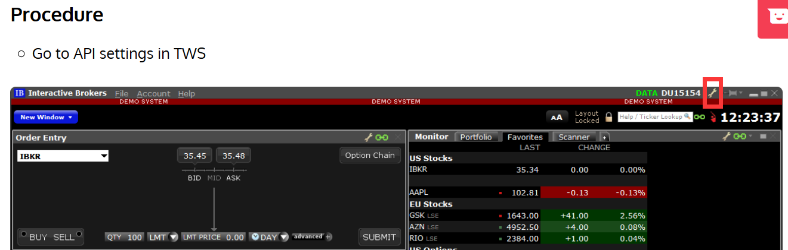

-   Check the **Enable ActiveX and Socket Clients**

-   Set **Socket port** to unused port.

-   Set the **Master API client ID** to 100

-   Create a **Trusted IP Address** and set to 127.0.0.1

### Running the first program

**So, all done with the configuration?**

Great! We are now ready to run our first program.

Before you start typing in those codes, make sure that you have started TWS (or
IB Gateway). Many times, I get questions as to why we get an error message when
the code is run. Like I had mentioned in the previous section, **your system is
connected to the Interactive Brokers’ server through the TWS or IB Gateway. So,
if you haven’t turned it on, then you are bound to get an exception message**,
no matter how smartly you have developed your code.

**Let’s start working on the coding step-by-step.**

（这里使用jetbrain）

Open Spyder (Start – All Programs – Anaconda2 – Spyder)

On the Spyder console, I will be entering my codes.

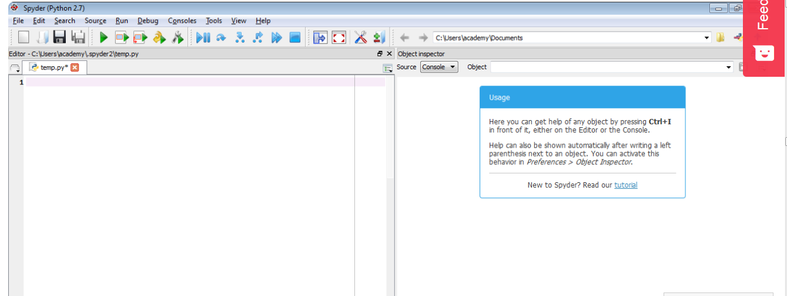

##### 1) We start by importing necessary modules for our code:

from ib.opt import Connection, message

**Connection** is a module that connects the API with IB while **message**
performs the task of a courier between the server and the system, it basically
retrieves messages from the Interactive Brokers server.

from ib.ext.Contract import Contract

from ib.ext.Order import Order

Just like every transaction in the real-world involves some kind of a contract
or agreement, we have **Contract** here as well. All **orders** on Interactive
Brokers are made using **contract**.

def error_handler(msg):

    print "Server Error:", msg

def server_handler(msg):

print "Server Msg:", msg.typeName, "-", msg

##### 2) Making the contract function

def make_contract(symbol, sec_type, exch, prim_exch, curr):

    Contract.m_symbol = symbol

    Contract.m_secType = sec_type

    Contract.m_exchange = exch

    Contract.m_primaryExch = prim_exch

    Contract.m_currency = curr

    return Contract

The contract function has the following parameters:

-   Symbol

-   Security Type

-   Exchange

-   Primary Exchange

-   Currency

The values of these parameters must be set accordingly.

##### 3) Setting the Order Function

**Order** function allows us to make orders of different types. The order
function has the following parameters:

-   Order Type

-   Total Quantity

-   Market Action (Buy or sell)

Considering that our order does have a set price, we code it in the following
way:

def create_order(order_type, quantity, action):

    order = Order()

    order.m_orderType = order_type

    order.m_totalQuantity = quantity

    order.m_action = action

    return order

The conditional statement will now set up the order as a simple market order
without any set price.* *

    else:

        order = Order()

        order.m_orderType = 'MKT'

        order.m_totalQuantity = quantity

        order.m_action = action

    return order

**The client id & port should be the same as you had set in the Global
preferences**

if \__name_\_ == "__main__":  

    client_id = 100

    order_id = 122

    port = 7496

    tws_conn = None   

try:

##### 4) Initiating Connection to API

Establish the connection to TWS.

        tws_conn = Connection.create(port=port,

                                     clientId=client_id)

        tws_conn.connect()

Assign error handling function.

        tws_conn.register(error_handler, 'Error')

Assign server messages handling function.

        tws_conn.registerAll(server_handler)

Create AAPL contract and send order

        aapl_contract = create_contract('AAPL',

                                        'STK',

                                        'SMART',

                                        'SMART',

                                        'USD')

In the above line, AAPL is Apple Inc. and STK is the name of the security type.
The exchange and primary exchange has been set to SMART. When we set these two
parameters to SMART, then we are actually using Interactive Brokers smart
routing system which enables the algo to find the best route to carry out the
trade. And of course, the currency has been set to USD.

We wish to sell 100 shares of AAPL

        aapl_order = create_order('MKT', 100, 'SELL')

Our order is to sell 1 stocks and our price is \$100.

We have placed an order on IB TWS with the following parameters:

-   Order id

-   Contract

-   offer

tws_conn.placeOrder(order_id, aapl_contract, aapl_order)  * *

“Always remember that the order id should be unique.”

##### 5) Disconnecting

And finally you need to disconnect:  *    *

conn.disconnect()

Yes, you are done with your first order on Interactive brokers’ API using basic
Python coding. Keep in mind that the demo account that you are using might not
give you all the privileges of a paid account.

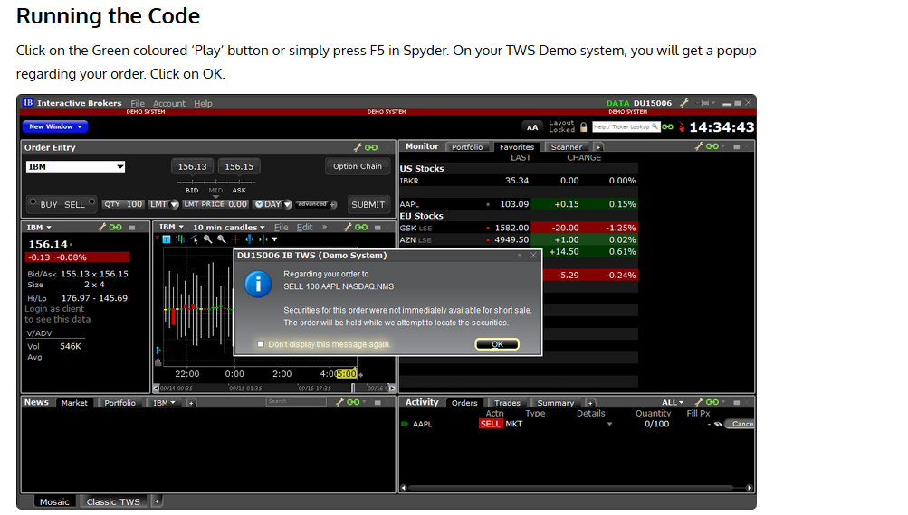

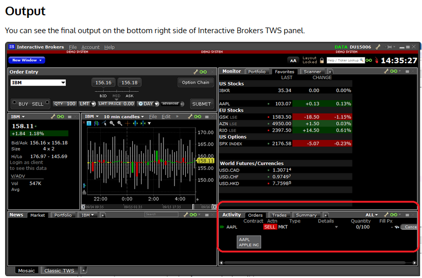

**Just in case you want to have a look at the complete code at one go, here it
is:**

""" A Simple Order Routing Mechanism """

from ib.ext.Contract import Contract

from ib.ext.Order import Order

from ib.opt import Connection

def error_handler(msg):

print "Server Error:", msg

def server_handler(msg):

print "Server Msg:", msg.typeName, "-", msg

def create_contract(symbol, sec_type, exch, prim_exch, curr):

contract = Contract()

contract.m_symbol = symbol

contract.m_secType = sec_type

contract.m_exchange = exch

contract.m_primaryExch = prim_exch

contract.m_currency = curr

return contract

def create_order(order_type, quantity, action):

order = Order()

order.m_orderType = order_type

order.m_totalQuantity = quantity

order.m_action = action

return order

if \__name_\_ == "__main__":

client_id = 100

order_id = 122

port = 7496

tws_conn = None

try:

\# Establish connection to TWS.

tws_conn = Connection.create(port=port,

clientId=client_id)

tws_conn.connect()

\# Assign error handling function.

tws_conn.register(error_handler, 'Error')

\# Assign server messages handling function.

tws_conn.registerAll(server_handler)

\# Create AAPL contract and send order

aapl_contract = create_contract('AAPL',

'STK',

'SMART',

'SMART',

'USD')

\# Go long 100 shares of AAPL

aapl_order = create_order('MKT', 100, 'SELL')

\# Place order on IB TWS.

tws_conn.placeOrder(order_id, aapl_contract, aapl_order)

finally:

\# Disconnect from TWS

if tws_conn is not None:

tws_conn.disconnect()

### Next Step

 

Our post on ‘*Architecture Explained of R Package for IB – IBrokers*‘ explains
the architecture of IBrokers R implementation in Interactive Brokers API which
allows executing orders in the IB Trader Workstation (TWS).

*Sources & References: quantstart.com, pythonprogramming.net,
interactivebrokers.com*
